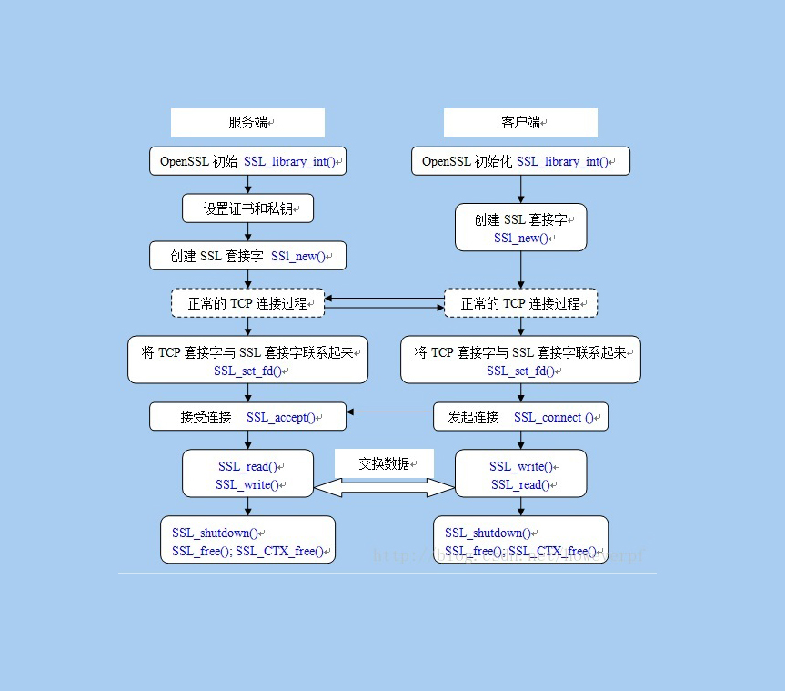
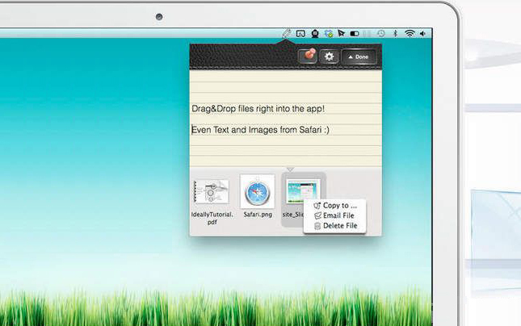

#这是一个测试和练习

####概述与声明
"Bco"这是一个学习github与git使用的git仓。如果您把它__clone__到您的电脑上，将得到一堆无用的东东，倘若您依然故我，那么就随心吧，只要最后不会桑心就好，呵呵。

####嵌入图解
######使用html标签

</img>

######使用md标签


######使用md中url
![443][jpg-url]

[jpg-url]:https://github.com/2lnx/bco/raw/master/443.jpg "Image Title"

####格式练习
######Block code 代码块格式
    这里就随便哈拉哈拉，这是表示一个block code
    var name = new Engine(core:2,thread:12);

######code
```
    funtion init(){
    	return 0;
    }
```

######什么鬼
@(标签)[案件|难点] 该行规则github不支持

1. 这个凶手
2. 他是侦探
3. 出现的是助手
4. 影法师


######引擎特性
- 超级变身
- 三体整合
- 统一通信API

######另类魔性
* 有些事情啊，不见得就是想要的。
* 技术就是这样，不要贪婪，否则__Bug__也是很贪婪！
* 架构的设计，不应是大而全，应该是够而美。
* 胡说八道容易话，圆谎很难全。
* 对于任何事情都保持无知的状态，却带着了如指掌的知识脑袋？
* 如果你无法通过_email_联系到我，那么就对了，因为这是我随便抓挠的，能用才怪，除非你有心。

######使用链接和参考链接
这样也行[布美文海][1]、[个性偏好][3]、[一切使命][2]、[待命武士][4]、<a href="http://bulmei.net/" title="闪光" target="_blank">闪光</a>
[1]: http://bulmei.com/home "bulmei"
[2]: http://bulmei.com/profile "个性偏好"
[3]: http://bulmei.com/about "一切关于您"
[4]: http://bulmei.com/support "随时待命"

######__技术支持__
- Email      _:_ <xyz@2lnx.cn>
- `新浪微博`  __-__[@练习册](https://weibo.com/11111111)
* `twitter`  __-__[@悠秀支持](https://twitter.com/0000000)

######使用表格布局
|平台        |     支持                                     |描述 |
|:----------:|:---------------------------------------------|:-----------------------------------------------------------|
|Email       | <xyz@2lnx.cn>                                |email最广泛的技术支持通道                                      |
|`新浪微博`  | [@练习册](https://weibo.com/34t43grffwefe3f2)|在国内热门在线互动支持方式，可以私信或者查看最新动态                |
|twitter     |[@悠秀支持](https://twitter.com/0000000)      |国外热门在线互动平台                                           |
|微信公众号  |`@小圈子大学问`                               |国内最新最热门服务社交平台，您可以通过朋友圈或公众号获得互动与服务信息  |

######这是引用
> 可以说吗？这是引用
> 因为这是没有的事儿
>

######小事儿


> 私

    设计者知道
